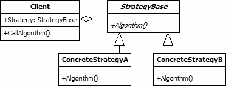

Strategy Design Pattern Using Ruby
==================================

This is a set of Ruby code that demonstrates the implementation of the Strategy Design Pattern.

It uses the Strategy Design Pattern to implement the logic for scoring a bowling game.

## Strategy Design Pattern
The strategy pattern is a design pattern that allows a set of similar algorithms to be defined and encapsulated in their own classes. The algorithm to be used for a particular purpose may then be selected at run-time according to your requirements.

### What is the Strategy Pattern?
The strategy pattern is a Gang of Four design pattern. This is a behavioural pattern as it defines a manner for controlling communication between classes or entities. The strategy pattern is used to create an interchangeable family of algorithms from which the required process is chosen at run-time. This allows the behaviour of a program to change dynamically according to configuration details or user preferences. It also increases flexibility by allowing new algorithms to be easily incorporated in the future.

As an example, the strategy pattern could be used within the scoring system of a bowling game.  Each bowling game consists of 10 Frames...

Below, is a simplified description of the scoring rules.  For details, see http://en.wikipedia.org/wiki/Ten-pin_bowling

#### How to score a bowling game
```
1. 10 Frames
2. Each frame throw the ball 2 times *
3. 10 pins
4. Each pin is worth 1 point


# Spare

7 3 -> Frame 1: 15
5 0 -> Frame 2: 15 + 5 -> 20


# Strike

10 0 -> Frame 1: 18
5 3 -> Frame 2: 18 + 8 -> 26
```


### Implementing the Strategy Pattern


The UML class diagram above describes an implementation of the strategy design pattern. The items in the diagram are described below:

- **Client** This class is the user of an interchangeable algorithm. The class includes a property to hold one of the strategy classes. This property will be set at run-time according to the algorithm that is required.

- **StrategyBase** This abstract class is the base class for all classes that provide algorithms. In the diagram the class includes a single method. However, there is no reason why a number of properties and methods may not be included. This class may be implemented as an interface if it provides no real functionality for its subclasses.

- **ConcreteStrategy A/B** The concrete strategy classes inherit from the StrategyBase class. Each provides a different algorithm that may be used by the client.


## Running Specs

To run "rspec", simply create the RSpec standard directories with appropriate files in each.

- **lib** - Application logic
- **spec** - RSpec test files


### Output
```
$ tree
.
├── README.md
├── lib
│   ├── bowling_game.rb
│   ├── frame.rb
│   ├── spare.rb
│   └── strike.rb
├── spec
│   └── bowling_spec.rb
└── strategy.png

2 directories, 7 files


$ rspec
Requiring /l3x/lex-dp-strategy-ruby/spec/../lib/bowling_game.rb
Requiring /l3x/lex-dp-strategy-ruby/spec/../lib/frame.rb
Requiring /l3x/lex-dp-strategy-ruby/spec/../lib/spare.rb
Requiring /l3x/lex-dp-strategy-ruby/spec/../lib/strike.rb
........

Finished in 0.00997 seconds
8 examples, 0 failures
```


## References
- http://en.wikipedia.org/wiki/Strategy_pattern
- http://www.blackwasp.co.uk/Strategy.aspx
- http://www.blackwasp.co.uk/GofPatterns.aspx
- http://en.wikipedia.org/wiki/Ten-pin_bowling
- http://rspec.info
